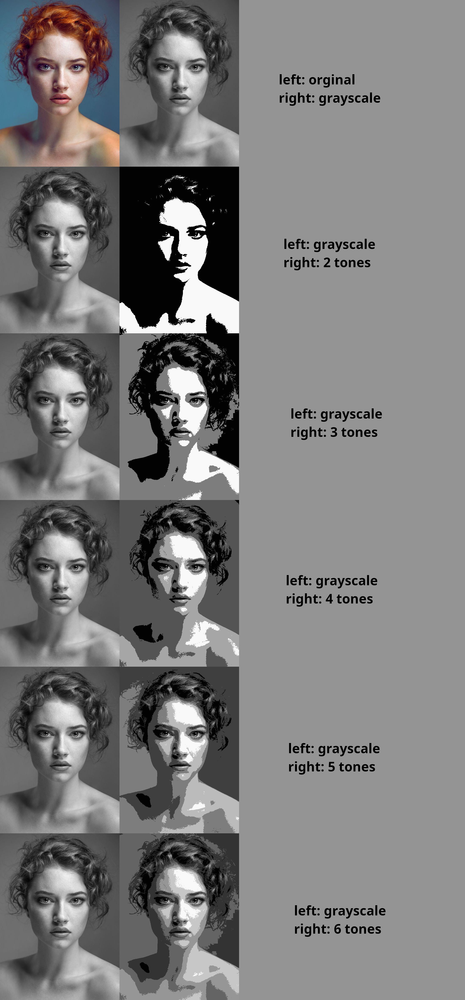

# tonalvalues

A command line tool that presents the tonal values of a jpg file.

It purpose is to help art students understand tonal values.

## Usage

The command expects one argument, the jpg file to analyse.
It creates an `output.jpg` file showing the tonal values of the original photo,
using different amounts of gray tones (2, 3 ... up to 6).

For example...

```
; tonalvalues example.jpg
```

... generates an `output.jpg` file looking like this:


